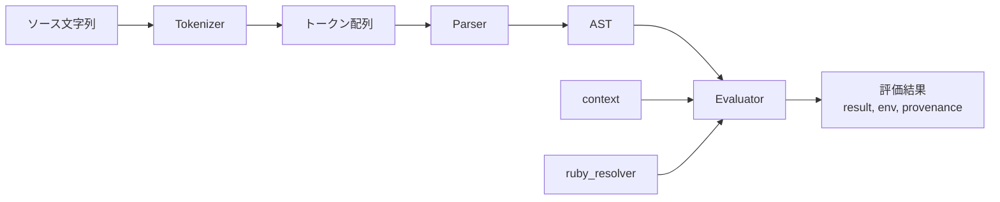
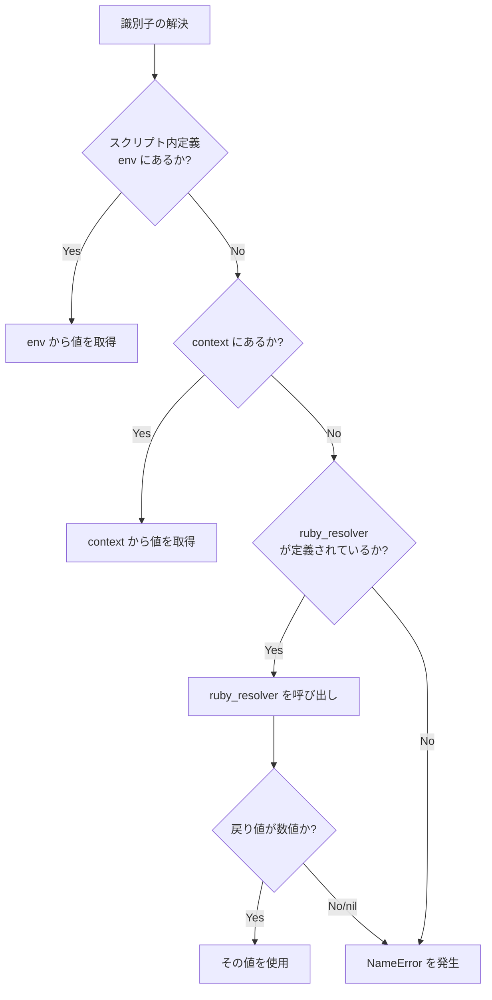
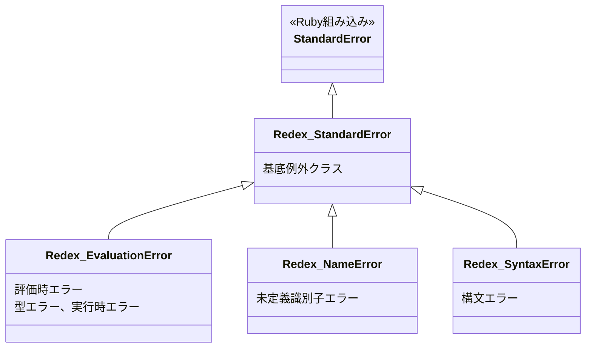

# Redex アーキテクチャ

目的
- 実装者向けの指針として各コンポーネントの責務、データフロー、依存関係を明確化する。

主要コンポーネント
- tokenizer: ソース文字列をトークン列に変換する。副作用を持たず、入力とトークン配列を返す。
- parser: トークン列からAST（抽象構文木）を構築する。構文エラーは専用例外で報告。
- ast: ASTノード定義とユーティリティ。イミュータブルか明示的な変換APIを提供。
- evaluator: ASTを評価して結果を返す。評価コンテキスト（env）を受け取り、更新したenvとresultを返す。
- resolver: 識別子の解決ロジック。`ruby_resolver` と `context` の統合点を提供。
- errors: 独自例外クラス群とエラー整形ロジック。
- cli/repl: コマンドラインインターフェース、対話モード。評価器を呼び出し結果を表示。
- spec: 単体・結合テスト。

モジュール境界とAPI
- 評価APIは少なくとも次を返す: `result`（評価値）, `env`（評価後環境ハッシュ）
- 追加フィールド（可能なら）: `errors`（配列）, `provenance`（識別子の出所情報）, `meta`（実行時間等）
- 各モジュールは入力検証を行い、期待される型でない場合は `Redex::EvaluationError` を投げる。

データフロー（高レベル）
1. ソース文字列を `tokenizer` に渡す → トークン配列
2. トークン配列を `parser` に渡す → AST
3. ASTと初期 `context` を `evaluator` に渡す → 評価結果 (`result`, `env`, ...)

`context` と `ruby_resolver` の設計（重要）
- 解決順序: スクリプト内定義（ローカル） → `context` → `ruby_resolver`

- `context`:
  - 呼び出し側が渡す初期環境を表すハッシュ
  - 値は数値のみ許容。数値以外が渡された場合は `Redex::EvaluationError` を発生させる
  - `context` の検証は `evaluator` 起点で行う（早期エラー検出）
- `ruby_resolver`:
  - シグネチャ: `->(code_or_ident, context_hash)` を想定
  - `ruby_resolver` は数値を返すこと。未解決やエラー時は `nil` または例外で扱うが、仕様上は例外よりも `nil` を返し呼び出し元で `EvaluationError` に変換することを推奨
  - `ruby_resolver` は外部（ホスト）呼び出しのフック。将来的にサンドボックス化のポイントになる

エラーハンドリング方針
- 例外クラス階層:
  - `Redex::StandardError`（基底、Ruby の StandardError を継承）
  - `Redex::EvaluationError`（評価時の型や解決エラー、実行時エラー）
  - `Redex::NameError`（未定義識別子）
  - `Redex::SyntaxError`（構文エラー、パース時）

- 伝播ルール:
  - ライブラリAPIは例外を投げる（内部実装は捕捉して `errors` 配列に追加することが可能）
  - CLI/REPL 層は例外を受け取りユーザ向けに整形して表示する

拡張性とセキュリティ
- 各モジュールは小さく保つ（SRP）ことで差し替えを容易にする
- `ruby_resolver` は明確な境界で呼び出され、将来的に安全な実行環境でラップ可能
- サンドボックス化はこのチケットの範囲外。別チケットで検討・実装する

テスト戦略
- 単体テスト: 各モジュールの主要関数を網羅（tokenizer, parser, evaluator の境界条件）
- 結合テスト: ソース→評価のパイプラインを検証（期待結果と副作用の検証）
- プロパティテスト（必要に応じて）: 変換・評価の逆変換や恒等性の性質
- テストデータ: `spec/fixtures/` にサンプルスクリプトを置く

設計決定ログ（要約）
- `context` は呼び出しが渡す初期環境で数値以外は許容しない（`EvaluationError`）
- `ruby_resolver` のシグネチャを `->(code_or_ident, context_hash)` とする
- 評価APIは最低限 `result` と `env` を返す

受け入れ基準との対応
- 本ドキュメントは `docs/architecture.md` として作成済み
- `ruby_resolver` と `context` の解決順とエラー仕様を明記
- 拡張ポイントとテスト戦略を記載

今後の作業候補
- アーキテクチャ図の精緻化（SVG または PNG）
- 設計決定ログの追加（decision record）
- 実装チケットに紐づく詳細設計書の作成
