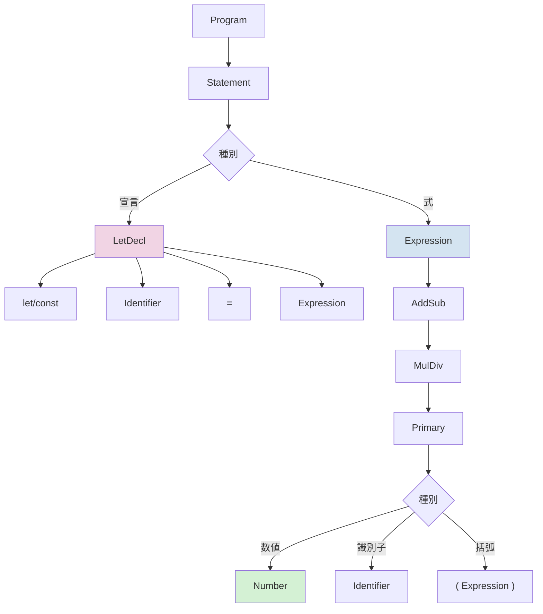
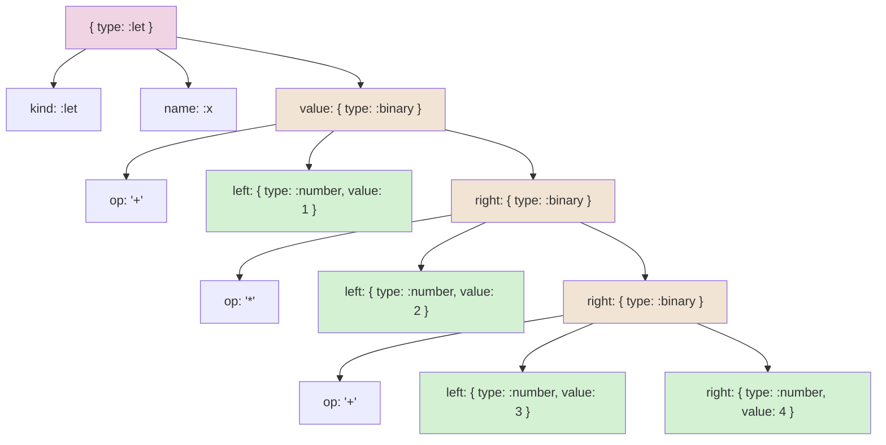

# EBNF 仕様（簡易）

この文書は `lib/redex/tokenizer.rb` と `lib/redex/parser.rb` の実装に基づく、言語の字句／構文仕様を EBNF でまとめたものです。

## 概要
- 対象: 算術式、識別子、`let`/`const` 宣言を含む簡易言語
- 優先順位: `*` `/` > `+` `-`（左結合）
- リテラル: 整数（符号なしの10進整数）のみをサポート
- 識別子: ASCII 範囲の英数字とアンダースコア（先頭は英字またはアンダースコア）

---

## 字句（トークン）
トークナイザは以下のトークン種別を返します（`Token = Struct.new(:type, :value)`）。

- `:number`  : 整数リテラル（Ruby 側の `value` は Integer）
  - 正規表現: /[0-9]+/
- `:ident`   : 識別子（変数名）
  - 正規表現: /[A-Za-z_][A-Za-z0-9_]*/
- `:keyword` : キーワード（現状: `let`, `const`）
- `:op`      : 単一文字演算子（`+ - * / =`）
- `:lparen`  : `(`
- `:rparen`  : `)`
- `:lparen`  : `(`
- `:rparen`  : `)`
- `:newline` : 行区切り（"\n"）。文の区切りや空行判定に使用される。
- `:unknown` : 未知の文字（トークナイザはそのまま `:unknown` を返す）

注: 将来的に文字列リテラル、浮動小数点、複合演算子などを追加する場合はここを拡張します。

---

## トークン → EBNF ターム対応
- `number`  => <number>
- `ident`   => <ident>
- `keyword` => <keyword>
- `op`      => 演算子ターム（`+ - * / =`）
- `lparen`/`rparen` => `(` / `)`

---

## EBNF（構文）
以下は拡張バッカス・ナウア記法（EBNF）での記述例です。必要に応じて左再帰除去や別表現に変換してください。

Program     ::= Statement { Newline Statement }

Note: 実装上、複数行ソースは改行で区切られ、空行は無視されます。最終行の末尾改行は必須ではありません。

Statement   ::= LetDecl | Expression

LetDecl     ::= KeywordLetOrConst Identifier "=" Expression
KeywordLetOrConst ::= "let" | "const"

Expression  ::= AddSub

AddSub      ::= MulDiv { ("+" | "-") MulDiv }

MulDiv      ::= Primary { ("*" | "/") Primary }

Primary     ::= Number
              | Identifier
              | "(" Expression ")"

Number      ::= <number>
Identifier  ::= <ident>

---

## 具体例
入力ソース:

    let x = 1 + 2 * (3 + 4)

トークン列（順序）:

    [(:keyword, "let"), (:ident, "x"), (:op, "="), (:number, 1), (:op, "+"), (:number, 2), (:op, "*"), (:lparen, "("), (:number, 3), (:op, "+"), (:number, 4), (:rparen, ")")]

簡易 AST（`lib/redex/parser.rb` が返す形式）:

    {
      :type => :let,
      :kind => :let,
      :name => :x,
      :value => {
        :type => :binary,
        :op => "+",
        :left => { :type => :number, :value => 1 },
        :right => {
          :type => :binary,
          :op => "*",
          :left => { :type => :number, :value => 2 },
          :right => {
            :type => :binary,
            :op => "+",
            :left => { :type => :number, :value => 3 },
            :right => { :type => :number, :value => 4 }
          }
        }
      }
    }

---

## 未知トークンの扱い
- 現在の `Tokenizer` 実装は未知文字を `:unknown` トークンとして返します。
- 仕様としては、文書化された字句規則に含まれない文字はパース前にエラーとするか、パーサ側で `ParseError` を返すことを推奨します（現状の `Parser` は `:unknown` を受け取ると `unexpected token` を raise します）。

---

## 今後の拡張案（オプション節）
- 文字列リテラル（`"..."`）とエスケープシーケンス
- 浮動小数点リテラルの追加
- 複合演算子（`==`, `!=`, `<=`, `>=`, `&&`, `||`）の導入
- Unicode 識別子サポート

---

## テストへの影響（提案）
- トークナイザのユニットテストで、各トークン種別の具体例を追加する。
- パーサのテストで EBNF の代表的な文法ケース（優先順位、括弧、let/const）をカバーする。 

