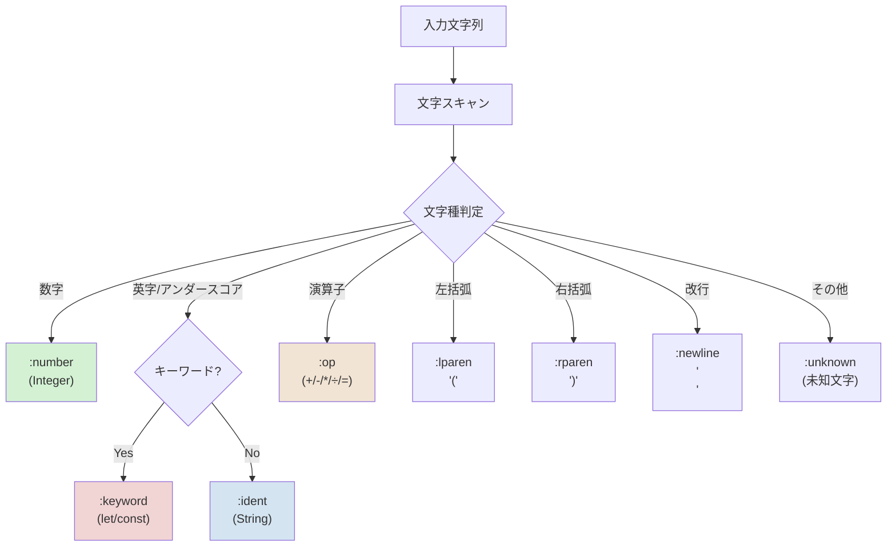

# トークナイザ（Tokenizer）

## 概要

`Redex::Tokenizer` は空白区切りを基本とした簡易トークナイザです。入力文字列を走査し、トークンの配列を返します。トークンは `Token = Struct.new(:type, :value)` で表現されます。

## API

- `Redex::Tokenizer.tokenize(input)`
  - 引数: `input` (String)
  - 戻り値: `Array<Redex::Tokenizer::Token>`（各要素は `:type` と `:value` を持つ `Struct`）
  - パラメータ: `input`: `String` - トークナイズ対象のソース文字列
  - 戻り値: `Array<Redex::Tokenizer::Token>` - `Token` は `Struct.new(:type, :value)` で表現される

例:

```
input = "let x = 10 + (y - 2)"
tokens = Redex::Tokenizer.tokenize(input)
# => [Token(:keyword, "let"), Token(:ident, "x"), Token(:op, "="), Token(:number, 10), Token(:op, "+"), Token(:lparen, "("), Token(:ident, "y"), Token(:op, "-"), Token(:number, 2), Token(:rparen, ")")]
```

（注）実際の `Token` は `Struct.new(:type, :value)` であり、上の表記は読みやすさのための擬似表現です。

## 認識するトークン種別



- `:number` — 整数リテラル（`value` は Ruby の `Integer`）。現在は整数のみ対応。
- `:ident` — 識別子（英数字とアンダースコア）。`value` は文字列。
- `:keyword` — キーワード（現時点では `let`, `const`）。`value` は文字列。
- `:op` — 単一文字演算子（`+ - * / =`）。`value` は演算子文字列。
- `:lparen` — 左括弧 `(`。`value` は "("。
- `:rparen` — 右括弧 `)`。`value` は ")"。
- `:newline` — 行区切り（"\n"）。パーサで文の区切りや空行判定に使用される。
- `:unknown` — トークナイザで認識できない単一文字。`value` はその文字（例: 非ASCII 記号など）。
  型の詳細（`Redex::Tokenizer::Token` の `value` 型）:

  - `:number` => `Integer`（将来的に `Float` を含める可能性あり）
  - `:ident`  => `String`
  - `:keyword` => `String`
  - `:op` => `String`（単一文字）
  - `:lparen`, `:rparen` => `String` ("(" / ")")
  - `:unknown` => `String`（未知文字）

## 未知文字の扱い

現行実装では、未定義の文字は例外を投げず `:unknown` トークンとして返します。パーサ側で必要に応じて扱い（無視・エラー化）を行う想定です。

利点: 互換性が高く、上位コンポーネントにエラーハンドリングを委譲できます。
欠点: 早期に厳密な入力検査をしたい場合は例外を導入したほうが明確です。

## 制限事項

- 浮動小数点リテラルは未対応（整数のみ）。
- 識別子は ASCII の英字・数字・アンダースコアに限定。
- 文字列リテラル、コメント、複数文字からなる演算子（例: `==`, `!=`）などは未実装。

## 将来の拡張案

- 浮動小数点リテラルのサポート。
- Unicode を考慮した識別子（非ASCII文字の許可）。
- 文字列リテラルとエスケープシーケンスの追加。
- 複合演算子（`==`, `<=` など）のサポート。
- `:unknown` の代わりに `Redex::TokenizerError`（例外）を投げるオプションを提供。

## テスト

トークナイザの仕様に基づき、`spec/tokenizer_spec.rb` に次のようなケースを追加/確認してください:

- 正常系: 数値、識別子、キーワード、演算子、括弧の分割。
- 境界値: 空文字列、連続する空白、連続する演算子。
- 未知文字: `:unknown` トークンが返ること（将来的に例外方針に変更する場合はテストを更新）。

## 関連ファイル

- 実装: [lib/redex/tokenizer.rb](lib/redex/tokenizer.rb)
- テスト: [spec/tokenizer_spec.rb](spec/tokenizer_spec.rb)

